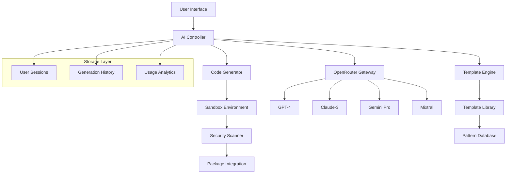

# Design Document - AI MCP Creator

## Overview

The AI MCP Creator is a sophisticated feature that transforms natural language descriptions into functional Model Context Protocol configurations. Built on OpenRouter's multi-model architecture, it provides an intuitive interface for both technical and non-technical users to create custom MCPs through conversational AI interactions.

## Architecture

### High-Level Architecture



### System Components

#### 1. AI Controller Service
- **Purpose**: Orchestrates AI interactions and manages generation workflow
- **Responsibilities**:
  - Route requests to appropriate AI models
  - Manage conversation context and history
  - Handle model fallbacks and retries
  - Track usage and billing

#### 2. OpenRouter Gateway
- **Purpose**: Interface with OpenRouter API for multi-model access
- **Responsibilities**:
  - Authenticate with OpenRouter
  - Route requests to selected models
  - Handle rate limiting and quotas
  - Manage API key rotation

#### 3. Template Engine
- **Purpose**: Provide structured MCP templates and patterns
- **Responsibilities**:
  - Store and retrieve MCP templates
  - Match user requirements to appropriate templates
  - Customize templates based on AI input
  - Learn from successful generations

#### 4. Code Generator
- **Purpose**: Transform AI responses into valid MCP code
- **Responsibilities**:
  - Parse AI-generated content
  - Apply code formatting and validation
  - Inject required dependencies
  - Generate configuration files

#### 5. Sandbox Environment
- **Purpose**: Safely test generated MCPs before deployment
- **Responsibilities**:
  - Execute MCP code in isolation
  - Validate functionality and performance
  - Capture test results and errors
  - Prevent malicious code execution

#### 6. Security Scanner
- **Purpose**: Analyze generated code for security vulnerabilities
- **Responsibilities**:
  - Static code analysis
  - Dependency vulnerability scanning
  - Pattern-based threat detection
  - Compliance validation

## Components and Interfaces

### Frontend Components

#### AICreatorPage Component
```typescript
interface AICreatorPageProps {
  user: User;
  currentPackage: Package;
}

interface AICreatorState {
  conversation: ConversationMessage[];
  currentGeneration: MCPGeneration | null;
  selectedModel: AIModel;
  isGenerating: boolean;
  testResults: TestResult | null;
}
```

#### ConversationInterface Component
```typescript
interface ConversationInterfaceProps {
  messages: ConversationMessage[];
  onSendMessage: (message: string) => void;
  isLoading: boolean;
  selectedModel: AIModel;
  onModelChange: (model: AIModel) => void;
}

interface ConversationMessage {
  id: string;
  role: 'user' | 'assistant' | 'system';
  content: string;
  timestamp: Date;
  metadata?: {
    model?: string;
    tokens?: number;
    cost?: number;
  };
}
```

#### CodePreview Component
```typescript
interface CodePreviewProps {
  code: string;
  language: string;
  onCodeChange: (code: string) => void;
  isEditable: boolean;
  testResults?: TestResult;
}

interface TestResult {
  success: boolean;
  output: string;
  errors: string[];
  warnings: string[];
  performance: {
    executionTime: number;
    memoryUsage: number;
  };
}
```

#### ModelSelector Component
```typescript
interface ModelSelectorProps {
  models: AIModel[];
  selectedModel: AIModel;
  onModelChange: (model: AIModel) => void;
  userTier: UserTier;
}

interface AIModel {
  id: string;
  name: string;
  provider: string;
  description: string;
  costPerToken: number;
  maxTokens: number;
  capabilities: string[];
  tier: 'free' | 'pro' | 'enterprise';
}
```

### Backend Services

#### AI Service
```typescript
class AIService {
  async generateMCP(
    prompt: string,
    model: AIModel,
    context: GenerationContext
  ): Promise<MCPGeneration>;
  
  async refineMCP(
    currentMCP: string,
    feedback: string,
    context: GenerationContext
  ): Promise<MCPGeneration>;
  
  async suggestImprovements(
    mcp: string,
    testResults: TestResult
  ): Promise<string[]>;
}

interface GenerationContext {
  userId: string;
  conversationHistory: ConversationMessage[];
  templates: MCPTemplate[];
  userPreferences: UserPreferences;
}

interface MCPGeneration {
  id: string;
  code: string;
  metadata: {
    model: string;
    prompt: string;
    tokens: number;
    cost: number;
    confidence: number;
  };
  templates: string[];
  dependencies: string[];
}
```

#### Template Service
```typescript
class TemplateService {
  async getTemplates(category?: string): Promise<MCPTemplate[]>;
  
  async matchTemplate(
    requirements: string
  ): Promise<MCPTemplate[]>;
  
  async customizeTemplate(
    template: MCPTemplate,
    customization: string
  ): Promise<string>;
  
  async learnFromGeneration(
    generation: MCPGeneration,
    success: boolean
  ): Promise<void>;
}

interface MCPTemplate {
  id: string;
  name: string;
  description: string;
  category: string;
  code: string;
  variables: TemplateVariable[];
  examples: string[];
  popularity: number;
}
```

#### Sandbox Service
```typescript
class SandboxService {
  async testMCP(
    code: string,
    testCases?: TestCase[]
  ): Promise<TestResult>;
  
  async validateSecurity(
    code: string
  ): Promise<SecurityResult>;
  
  async benchmarkPerformance(
    code: string
  ): Promise<PerformanceResult>;
}

interface SecurityResult {
  passed: boolean;
  vulnerabilities: Vulnerability[];
  recommendations: string[];
}

interface Vulnerability {
  type: string;
  severity: 'low' | 'medium' | 'high' | 'critical';
  description: string;
  line: number;
  suggestion: string;
}
```

## Data Models

### Database Schema

#### ai_generations Table
```sql
CREATE TABLE ai_generations (
  id UUID PRIMARY KEY DEFAULT gen_random_uuid(),
  user_id UUID REFERENCES users(id),
  prompt TEXT NOT NULL,
  model VARCHAR(100) NOT NULL,
  generated_code TEXT NOT NULL,
  metadata JSONB,
  status VARCHAR(50) DEFAULT 'draft',
  created_at TIMESTAMP DEFAULT NOW(),
  updated_at TIMESTAMP DEFAULT NOW()
);
```

#### conversation_sessions Table
```sql
CREATE TABLE conversation_sessions (
  id UUID PRIMARY KEY DEFAULT gen_random_uuid(),
  user_id UUID REFERENCES users(id),
  generation_id UUID REFERENCES ai_generations(id),
  messages JSONB NOT NULL,
  context JSONB,
  created_at TIMESTAMP DEFAULT NOW(),
  updated_at TIMESTAMP DEFAULT NOW()
);
```

#### mcp_templates Table
```sql
CREATE TABLE mcp_templates (
  id UUID PRIMARY KEY DEFAULT gen_random_uuid(),
  name VARCHAR(255) NOT NULL,
  description TEXT,
  category VARCHAR(100),
  code TEXT NOT NULL,
  variables JSONB,
  examples JSONB,
  popularity INTEGER DEFAULT 0,
  created_at TIMESTAMP DEFAULT NOW()
);
```

#### usage_tracking Table
```sql
CREATE TABLE usage_tracking (
  id UUID PRIMARY KEY DEFAULT gen_random_uuid(),
  user_id UUID REFERENCES users(id),
  action VARCHAR(100) NOT NULL,
  model VARCHAR(100),
  tokens_used INTEGER,
  cost DECIMAL(10,6),
  created_at TIMESTAMP DEFAULT NOW()
);
```

## Error Handling

### Error Types and Responses

#### AI Generation Errors
```typescript
enum AIErrorType {
  MODEL_UNAVAILABLE = 'MODEL_UNAVAILABLE',
  QUOTA_EXCEEDED = 'QUOTA_EXCEEDED',
  INVALID_PROMPT = 'INVALID_PROMPT',
  GENERATION_FAILED = 'GENERATION_FAILED',
  TIMEOUT = 'TIMEOUT'
}

interface AIError {
  type: AIErrorType;
  message: string;
  retryable: boolean;
  suggestedAction?: string;
}
```

#### Fallback Strategy
1. **Primary Model Failure**: Retry with same model (max 2 attempts)
2. **Model Unavailable**: Switch to fallback model in same tier
3. **Quota Exceeded**: Suggest upgrade or wait period
4. **All Models Failed**: Queue request for later processing

### User-Facing Error Messages
```typescript
const ERROR_MESSAGES = {
  MODEL_UNAVAILABLE: "The selected AI model is temporarily unavailable. We've switched to an alternative model.",
  QUOTA_EXCEEDED: "You've reached your monthly generation limit. Upgrade your plan to continue creating MCPs.",
  INVALID_PROMPT: "Please provide more details about what you'd like your MCP to do.",
  GENERATION_FAILED: "We couldn't generate your MCP. Please try rephrasing your request.",
  TIMEOUT: "Generation is taking longer than expected. We'll notify you when it's ready."
};
```

## Testing Strategy

### Unit Testing
- **AI Service**: Mock OpenRouter responses, test prompt processing
- **Template Service**: Test template matching and customization
- **Sandbox Service**: Test code execution and security validation
- **Code Generator**: Test code parsing and formatting

### Integration Testing
- **End-to-End Generation**: Full workflow from prompt to tested MCP
- **Model Fallback**: Test failover scenarios
- **Security Pipeline**: Test malicious code detection
- **Performance**: Load testing with concurrent generations

### User Acceptance Testing
- **Prompt Variety**: Test with diverse user inputs
- **Model Comparison**: Compare outputs across different models
- **Iterative Refinement**: Test conversation-based improvements
- **Package Integration**: Test adding generated MCPs to packages

## Performance Considerations

### Optimization Strategies

#### Caching
- **Template Cache**: Cache frequently used templates in Redis
- **Model Response Cache**: Cache similar prompts for 1 hour
- **User Context Cache**: Cache conversation history for active sessions

#### Async Processing
- **Queue System**: Use Bull Queue for long-running generations
- **Streaming Responses**: Stream AI responses for better UX
- **Background Testing**: Run security scans asynchronously

#### Resource Management
- **Connection Pooling**: Pool OpenRouter API connections
- **Rate Limiting**: Implement user-based rate limiting
- **Resource Monitoring**: Monitor CPU/memory usage in sandbox

### Performance Targets
- **Generation Time**: < 30 seconds for 95% of requests
- **UI Responsiveness**: < 200ms for all user interactions
- **Concurrent Users**: Support 100+ simultaneous generations
- **Uptime**: 99.9% availability for AI services

## Security Implementation

### Input Validation
```typescript
class PromptValidator {
  validatePrompt(prompt: string): ValidationResult {
    // Check for malicious patterns
    // Validate length and content
    // Sanitize input
  }
  
  sanitizeCode(code: string): string {
    // Remove potentially dangerous code
    // Validate against whitelist
    // Apply security transformations
  }
}
```

### Sandbox Security
- **Container Isolation**: Docker containers with limited resources
- **Network Restrictions**: No external network access
- **File System**: Read-only with limited write access
- **Execution Limits**: CPU and memory constraints
- **Time Limits**: Maximum execution time of 30 seconds

### API Security
- **Authentication**: JWT tokens for all requests
- **Authorization**: Role-based access control
- **Rate Limiting**: Per-user and per-IP limits
- **Input Sanitization**: Validate all user inputs
- **Audit Logging**: Log all AI interactions

## Monitoring and Analytics

### Key Metrics
- **Generation Success Rate**: Percentage of successful generations
- **Model Performance**: Response time and quality by model
- **User Engagement**: Conversation length and refinement cycles
- **Security Incidents**: Failed security scans and blocked code
- **Cost Tracking**: AI usage costs by user and model

### Alerting
- **High Error Rates**: Alert when generation failures exceed 5%
- **Security Threats**: Immediate alerts for malicious code attempts
- **Cost Overruns**: Alert when costs exceed budget thresholds
- **Performance Degradation**: Alert when response times exceed targets

### Dashboard Metrics
```typescript
interface AIMetrics {
  totalGenerations: number;
  successRate: number;
  averageResponseTime: number;
  costPerGeneration: number;
  popularModels: ModelUsage[];
  securityIncidents: number;
  userSatisfaction: number;
}
```

This design provides a robust, scalable, and secure foundation for the AI MCP Creator feature while maintaining excellent user experience and performance.